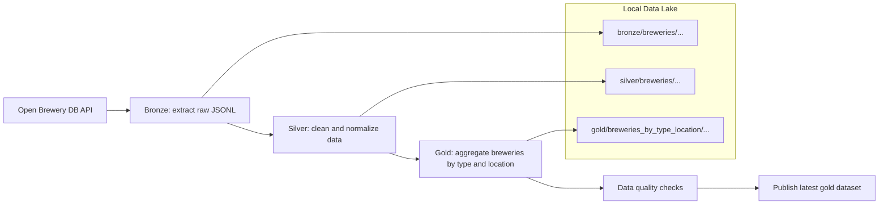

# Brewery Medallion Pipeline (Airflow)

This project implements a daily medallion-style data pipeline for the Open Brewery DB API using Apache Airflow, Pandas and PyArrow.

It ingests brewery data into a local data lake and organizes it into three layers:

- **Bronze**: raw JSONL snapshots, versioned by `ingestion_date` and `run_id`
- **Silver**: Parquet, normalized schema, partitioned by brewery location
- **Gold**: aggregated analytical dataset with brewery counts by type and location

The pipeline is designed for reproducibility, reprocessing and portability to cloud object storage such as S3, GCS, or ADLS.

## Requirements Mapping

- **Workflow orchestrator**: Apache Airflow
- **Bronze layer**: raw JSONL snapshots from Open Brewery DB
- **Silver layer**: Parquet, normalized schema, partitioned by brewery location
- **Gold layer**: aggregated analytical output
- **Data quality checks**: post-Gold validation task
- **Versioned executions**: all outputs are versioned by `ingestion_date` and `run_id`
- **Cloud-ready design**: `DATA_LAKE_BASE_PATH` can be switched from local storage to object storage

## Layer Formats

- **Bronze (`data/bronze/breweries/ingestion_date={ds}/run_id={run_id}/`)**
  - `breweries.jsonl` file with one JSON per line directly from the API.
  - `manifest.json` file with metadata: `ingestion_date`, `run_id`, `records`.

- **Silver (`data/silver/breweries/ingestion_date={ds}/run_id={run_id}/`)**
  - Written in Parquet by the `bronze_to_silver` job using Pandas + PyArrow.
  - Partitioned by `country` and `state_province`.
  - Normalizations:
    - standardizes column names to lowercase
    - canonicalizes `state` into `state_province`
    - replaces null, blank, or `none` values in key dimensions with `unknown`
    - casts latitude and longitude to `double`
    - removes duplicate records by `id`
    - adds execution metadata columns: `ingestion_date` and `run_id`

- **Gold (`data/gold/breweries_by_type_location/ingestion_date={ds}/run_id={run_id}/result.parquet`)**
  - Generated by the `silver_to_gold` job using Pandas.
  - Aggregated by `country`, `state_province`, `brewery_type` with `brewery_count`.
  - Adds `ingestion_date` and `run_id` columns.

- **Publish (`data/gold/breweries_by_type_location/`)**
  The publish step marks the current Gold run as successful and updates a `_LATEST.json` pointer for downstream discovery.
  - `_SUCCESS` file in the execution directory (`ingestion_date={ds}/run_id={run_id}`).
  - `_LATEST.json` file in the root of `gold` pointing to the most recent gold (dataset, `ingestion_date`, `run_id`, `gold_path`, `published_at_utc`).

## Architecture

This diagram summarizes the pipeline flow, from API ingestion to the published gold dataset.



The main DAG is defined in `dags/openbrewery_medallion.py` and runs daily. Each task receives `base_path`, `ds` (logical execution date), and `run_id`, enabling reproducible and versioned executions.

## Local Execution with Docker

### Prerequisites

- Python installed
- Docker Desktop
- Linux containers / WSL2 enabled
- Make installed

### Running Locally

1. Clone the repository

```bash
git clone <repository-url>
cd openbrewery-etl-medallion
```

2. Copy the environment file:

```bash
cp .env.example .env
```

> On Windows PowerShell, you can copy the environment file with:
> `Copy-Item .env.example .env`

3. Start the stack:

```bash
make airflow-start
```

4. Access Airflow and run the dag:

- UI: `http://localhost:8080`
- Credentials: defined in `.env`
- Enable the DAG `openbrewery_medallion`
- Click **Trigger DAG**

The `docker-compose.yml` mounts the `./dags`, `./src`, `./logs` and `./data` directories inside the container. Python dependencies are installed from `requirements.txt`.

All outputs are written under the local `data/` directory, organized by layer, `ingestion_date`, and `run_id`.

### Running Tests

The tests use pytest and cover:
- `src/clients/openbrewery.py`
- `src/jobs/bronze.py`
- `src/jobs/silver.py`
- `src/jobs/gold.py`
- `src/data_quality/checks.py`
- `src/jobs/publish.py`
- `src/paths/lake.py`       

Locally:
```bash
make test
```

## Monitoring and Data Quality

- Airflow retries and failure callback capture execution context (`dag_id`, `task_id`, `run_id`, `ds`, `try_number`, `log_url`, `exception`).
- The `data_quality_checks` task validates that the Gold dataset is not empty, contains the expected columns, enforces non-negative counts, and verifies aggregate consistency against the Silver layer.
- It also logs warnings for soft anomalies such as volume changes between runs, new brewery types, or increases in `unknown` values.
- In a production environment, the same failure callback could be extended to send alerts to email or Slack/Teams.

## Technical Decisions

- **Why Airflow and not another tool?**

  - Airflow is the industry standard for batch orchestration, with strong support for DAGs, retries, backfills, a rich UI and cloud integrations. For a daily ingestion case with clear task dependencies, it makes the modeling explicit and easy to explain.

- **Why Pandas and not PySpark?**

  - The Open Brewery DB dataset is small enough to be handled efficiently in-memory. Pandas keeps the implementation simpler, reduces local setup complexity and makes the project easier to run and review while still meeting the case requirements for Parquet outputs and partitioning by location.

- **Why partition by country and state_province?**

  - These are natural filter keys for location-based analyses. Partitioning by these columns reduces query read costs and aligns the storage layout with expected usage.

- **How to handle schema changes in the API?**

  - The bronze layer preserves the original payload, allowing historical reprocessing with new transformation logic.
  - The silver layer applies normalizations and canonicalizations (e.g., state → state_province), decoupling analytical consumers from API changes.

- **How to evolve to a fully managed cloud environment?**

  - Replace the local filesystem with object storage such as S3, GCS, or ADLS.
  - Run the DAG in a managed Airflow environment.
  - If data volume grows significantly, the transformation layer can be adapted from Pandas to a distributed engine such as Spark.
